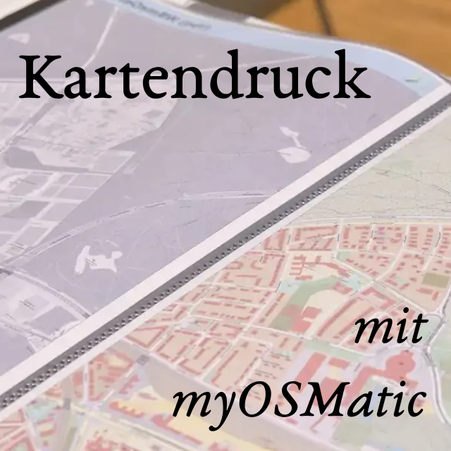

# Karten drucken

OSM-Karten können natürlich auch ausgedruckt werden. Speziell für den Druck
angepasste Karten kann man sich bei [MyOSMatic](https://print.get-map.org/)
erzeugen lassen.

Die Möglichkeiten sind dabei riesig. Du kannst den Kartenausschnitt und
Papiergröße selbst bestimmten. Es stehen über 30 verschiedene Kartenstile zur
Verfügung und es können noch mal so viele Overlays mit Zusatzinformationen
hinzugefügt werden, alles von Höhenlinien bis zu Wanderrouten. Auf Wunsch wird
auch ein Straßennamen-Index angelegt. Es ist auch möglich, eine Art Atlas zu
generieren mit mehreren zusammengehörenden Seiten.

Das Tool dahinter heißt [MapOSMatic]. Es ist natürlich Open Source, du kannst
es selbst installieren und erweitern.

Manchmal sind wir auch mit unserem Drucker auf einer [Veranstaltung](), dann
drucken wir dir gegen iene kleine Spende gerne eine Karte deiner Wahl.

Zuständig: Hartmut Holzgräfe

